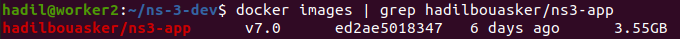
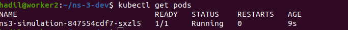
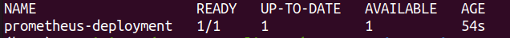
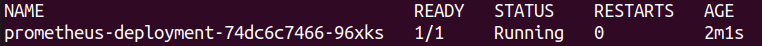
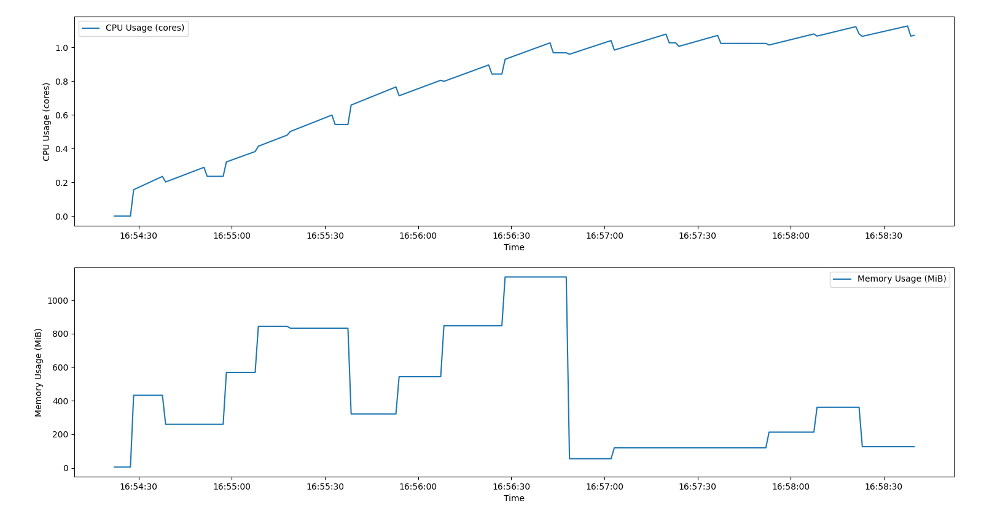

# NS-3 Kubernetes pod

  

## Description
This repository contains an NS-3 simulation pod that runs a C++ script (NS-3) "cttc-nr-mimo-demo-vbr-auto-ue.cc" to simulate different network conditions based on parameters provided in a csv file "output_with_UE.csv" . The simulation updates parameters at each timestep based on different time intervals and executes within a Kubernetes environment.
This project provides an NS-3 simulation environment running inside a Kubernetes pod. It dynamically updates parameters like the number of UEs, data rate, simulation time, and packet size based on the input CSV file , adjusting these values over different time intervals. In addition to running the simulation, the containerized setup offers real-time monitoring of CPU and memory usage using Prometheus, with resource usage visualizations generated through a Python script.

## Pre-requisite
Tested on Ubuntu 20.04

# Build a K8s cluster
We assume that a Kubernetes cluster is already running using this repository: https://github.com/AIDY-F2N/build-k8s-cluster

# Run the NS-3 Docker image and deploy the pod

Follow these steps to pull the Docker image, run it locally, and deploy it into a Kubernetes pod:

Pull the latest version of the NS-3 simulation image from Docker Hub.

    docker pull hadilbouasker/ns3-app:v7.0

Run this command to verify the installation of the docker image

    docker images | grep hadilbouasker/ns3-app

  

 

Apply the YAML configuration to deploy the NS-3 simulation as a pod in your cluster.

    kubectl apply -f ns3-simulation-pod.yaml

Check the status of the deployed pod to ensure it’s up and running.

    kubectl get pods
    

  

Check the logs of the pod by using this command:

    kubectl logs <name-of-the-pod>

  

# Setup Prometheus Monitoring

In this phase, we set up Prometheus on our Kubernetes cluster. This setup collects node, pods, and service metrics automatically using Prometheus service discovery configurations.

The "prometheus" folder contains all Prometheus Kubernetes Manifest Files. Inside the "prometheus" folder, open a terminal and execute the following command to create a new namespace named monitoring.

    kubectl create namespace monitoring
You can create the RBAC role by running the following command.

    kubectl create -f clusterRole.yaml

Create the ConfigMap by running the following command.

    kubectl create -f config-map.yaml

Deploy Prometheus in the monitoring namespace using the following command.

    kubectl create  -f prometheus-deployment.yaml 

You can check the created deployment using the following command.

    kubectl get deployments --namespace=monitoring

  

You can check the created pod using the following command.

    kubectl get pods --namespace=monitoring

  

Create the service using the following command:

    kubectl create -f prometheus-service.yaml --namespace=monitoring

# Monitor CPU & Memory usage

we included Prometheus-based monitoring to track resource usage inside the pod. A Python script is provided to visualize CPU and memory usage over time.

Before running the monitoring script, make sure to update the following parameters:

- **`--prometheus-url`**: replace with the URL of your Prometheus server.
- **`--pod-name`**: replace with the name of your specific pod (you can get the pod name using `kubectl get pods`).

      python3 monitor_resources.py --prometheus-url http://<your-prometheus-url>:<port> --pod-name <your-pod-name>
  
Example:

      python3 monitor_resources.py --prometheus-url http://157.159.68.41:30000 --pod-name ns3-simulation-847554cdf7-sxzl5
      

  

# About cttc-nr-mimo-demo-vbr-auto-ue.cc

This script builds upon the CTTC NS-3 MIMO demo, providing a framework for simulating MIMO scenarios using the 3GPP channel model from TR 38.900. The simulation environment consists of a single gNB and multiple UEs, dynamically adjusting key parameters according to predefined time intervals. The script is generated at each timestamp using the automate_sim_with_UE.py script, with changing variables including seconds, dataRate, simTime, packetSize, and numberOfUes, sourced from output_with_UE.csv. The simulation adapts to varying user densities and implements downlink flows with bandwidth adjustments.

# Modifications and customization
If you plan to modify the simulation, you can modify the simulation behavior by:

- Editing the output_with_UE.csv file to change the simulation parameters dynamically.

- Modifying the cttc-nr-mimo-demo-vbr-auto-ue.cc file to adjust the NS-3 simulation logic.

- Updating the Python script (automate_sim_with_UE.py) to change how parameters are injected into the simulation

Follow these steps to replace a file inside the docker image permanently:

Run a container from the image:

    docker run -it --name my-container hadilbouasker/ns3-app:v7.0 bash

Remove the old file inside the container:

    rm -rf /ns-3-dev/output_with_UE.csv

open another terminal without exiting the running container and and copy the new file from your local machine:

    docker cp /home/user/new_output_with_UE.csv my-container:/ns-3-dev/output_with_UE.csv

now go back to the other terminal and exit the container:

    exit

Commit the modified container to a new image:

    docker commit my-container hadilbouasker/ns3-app:v7.1

Run a new container from the modified image to verify:

    docker run -it hadilbouasker/ns3-app:v7.1 bash
    ls -lah /ns-3-dev/output_with_UE.csv

You can push the new image to your own DockerHub:

    docker login
    docker push your-dockerhub-username/ns3-app:v7.1
Lastly, to deploy the pod with the new image, you have to change the image name in the pod's manifest file.

# Delete the pod and the docker image: 
To completely remove the NS-3 simulation pod and its associated Docker image from your system, use the following commands:

Delete the Kubernetes deployment.

    kubectl delete deployment ns3-simulation

Remove the local Docker image to free up disk space.

    docker rmi -f hadilbouasker/ns3-app:v7.0

# Contact

Hadil Bouasker, hadil.bouasker@telecom-sudparis.eu

