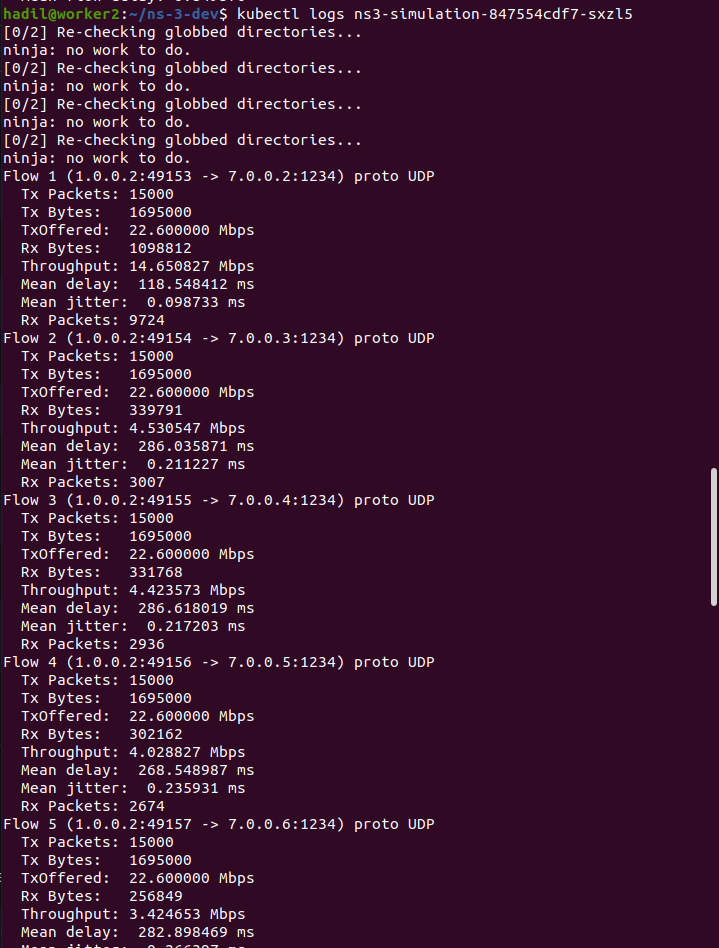

# ns3-kubernetes-simulation

  

## Description
This project provides an NS-3 simulation environment deployed in a Kubernetes pod. The simulation dynamically updates parameters such as the number of UEs, data rate, simulation time, and packet size based on the input CSV file (output_with_UE.csv), adapting these values over different time intervals. CPU and memory usage of the pod can be monitored with Prometheus, and a Python script is included to visualize these metrics over time.

The result is an environment that mimics dynamic workloads, useful both for:
- **Testing** system behavior under fluctuating demand
- **Training** ML models on realistic resource-usage traces
- 
## Scenarios & Images
We publish **two Docker image variants**, each representing a different simulation scenario:

| Image tag | Scenario | Description | CSV / Params |
|-----------|----------|-------------|--------------|
| `hadilbouasker/ns3-app:v10.8` | **Scenario 1 – Trace-driven** | Time-varying workload driven by CSV; periodic changes to UEs, data rate, sim time, packet size | `one_month.csv` |
| `hadilbouasker/ns3-app:v10.8` | **Scenario 2 – <your-scenario-name>** | <Short description of the second scenario> | `<7_month>` |

## Prerequisites
- Ubuntu 20.04 (tested)  
- A running Kubernetes cluster ; We assume that a Kubernetes cluster is already running using this repository: https://github.com/AIDY-F2N/build-k8s-cluster

## Quick Start

### 1) Pull the image

    docker pull hadilbouasker/ns3-app:v10.8

### 2) verify the installation of the docker image

    docker images hadilbouasker/ns3-app:v10.8

  

 

### 3) Deploy to Kubernetes

Edit the manifest file (`ns3-simulation-pod.yaml`) and set the image to either **Scenario 1** or **Scenario 2**:

  

Apply the manifest:

    kubectl apply -f ns3-simulation-pod.yaml

Check the status of the deployed pod to ensure it’s up and running.

    kubectl get pods
    

  

### 4) View logs

This allows you to display the C++ simulation output, which helps verify that NS-3 is running correctly.

    kubectl logs <name-of-the-pod>

  

## Setup Prometheus Monitoring

In this phase, we set up Prometheus on our Kubernetes cluster. This setup collects node, pods, and service metrics automatically using Prometheus service discovery configurations.

Inside the "prometheus" folder, open a terminal and execute the following commands one by one:

    kubectl create namespace monitoring
    
    kubectl create -f clusterRole.yaml

    kubectl create -f config-map.yaml

    kubectl create  -f prometheus-deployment.yaml 

    kubectl get deployments --namespace=monitoring

  

    kubectl get pods --namespace=monitoring

  

Finally, create the service using the following command:

    kubectl create -f prometheus-service.yaml --namespace=monitoring

## Monitor CPU & Memory usage

we included Prometheus-based monitoring to track resource usage inside the pod. A Python script is provided to visualize CPU and memory usage over time.

Before running the monitoring script, make sure to update the following parameters:

- **`--prometheus-url`**: replace with the URL of your Prometheus server.
- **`--pod-name`**: replace with the name of your specific pod.

      python3 monitor_resources.py --prometheus-url http://<your-prometheus-url>:<port> --pod-name <your-pod-name>
  
Example:

      python3 monitor_resources.py --prometheus-url http://157.159.68.41:30000 --pod-name ns3-simulation-847554cdf7-sxzl5
      

  

# About cttc-nr-mimo-demo-vbr-auto-ue.cc

This script builds upon the CTTC NS-3 MIMO demo, providing a framework for simulating MIMO scenarios using the 3GPP channel model from TR 38.900. The simulation environment consists of a single gNB and multiple UEs, dynamically adjusting key parameters according to predefined time intervals. The script is generated at each timestamp using the automate_sim_with_UE.py script, with changing variables including seconds, dataRate, simTime, packetSize, and numberOfUes, sourced from output_with_UE.csv. The simulation adapts to varying user densities and implements downlink flows with bandwidth adjustments.

# Modifications and customization
If you plan to modify the simulation, you can modify the simulation behavior by:

- Editing the output_with_UE.csv file to change the simulation parameters dynamically.

- Modifying the cttc-nr-mimo-demo-vbr-auto-ue.cc file to adjust the NS-3 simulation logic.

- Updating the Python script (automate_sim_with_UE.py) to change how parameters are injected into the simulation

Follow these steps to replace a file inside the docker image permanently:

Run a container from the image:

    docker run -it --name my-container hadilbouasker/ns3-app:v7.0 bash

Remove the old file inside the container:

    rm -rf /ns-3-dev/output_with_UE.csv

open another terminal without exiting the running container and and copy the new file from your local machine:

    docker cp /home/user/new_output_with_UE.csv my-container:/ns-3-dev/output_with_UE.csv

now go back to the other terminal and exit the container:

    exit

Commit the modified container to a new image:

    docker commit my-container hadilbouasker/ns3-app:v7.1

Run a new container from the modified image to verify:

    docker run -it hadilbouasker/ns3-app:v7.1 bash
    ls -lah /ns-3-dev/output_with_UE.csv

You can push the new image to your own DockerHub:

    docker login
    docker push your-dockerhub-username/ns3-app:v7.1
Lastly, to deploy the pod with the new image, you have to change the image name in the pod's manifest file.

# Delete the pod and the docker image: 
To completely remove the NS-3 simulation pod and its associated Docker image from your system, use the following commands:

Delete the Kubernetes deployment.

    kubectl delete deployment ns3-simulation

Remove the local Docker image to free up disk space.

    docker rmi -f hadilbouasker/ns3-app:v7.0

# Contact

Hadil Bouasker, hadil.bouasker@telecom-sudparis.eu

